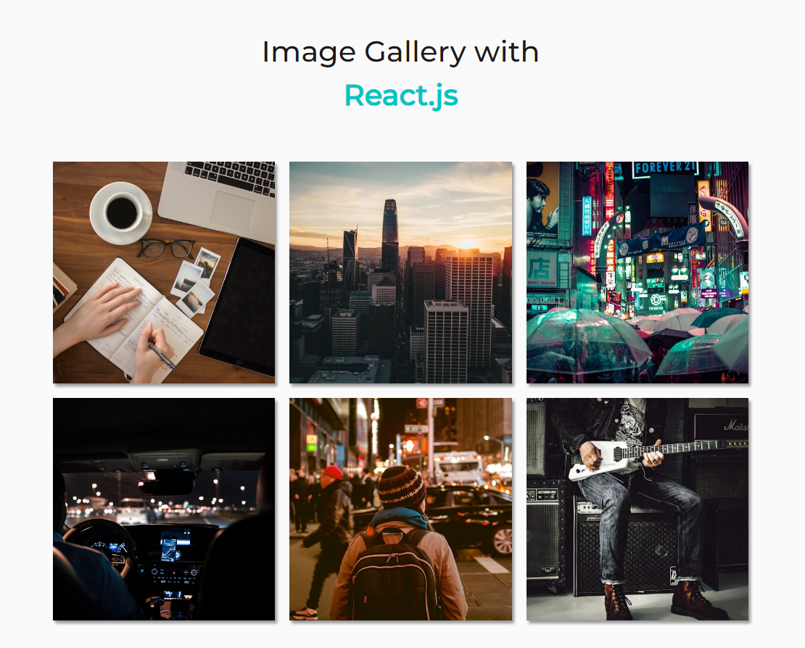

# Create a Stunning Image Gallery App with React.js and Vite

This guide walks you through building an interactive image gallery app utilizing the power of React.js for UI management and Vite for efficient development.

**Project Goal:**

Develop a visually appealing image gallery application resembling the provided screenshot:



**Project Structure:**

We'll establish a well-organized project structure, creating separate files for React components (`App.jsx`) and styles (`App.css`).

**Component Breakdown:**

- **GalleryCard:** This reusable component will represent a single image within the gallery. It'll be defined in a dedicated file (`GalleryCard.jsx`) and imported into `App.jsx`.

**Data Integration:**

- **Dynamic Image Display:** We'll define a `data` variable to hold image details. This data will be used to render six `GalleryCard` components, each showcasing a unique image and corresponding description.

**CSS Styling:**

- **Targeted Classes:** Within the `GalleryCard` component, we'll utilize CSS classes like `gallery`, `gallery-item`, and `gallery-image` to style the component's appearance.

- **Customizable Stylesheet:** The `App.css` file will house the CSS rules that define the overall layout and visual aesthetics of your image gallery.

**Getting Started (Steps to follow):**

1. **Project Initialization:** Install React project packages:

   ```bash
   npm i
   ```
